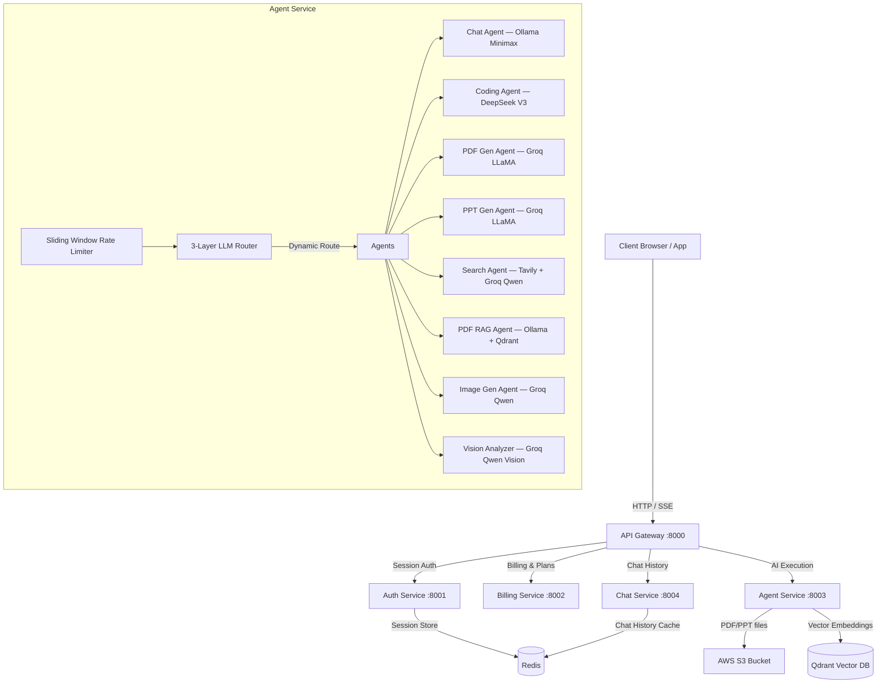

# CortexAI — Multi-Agent AI SaaS Platform

https://github.com/user-attachments/assets/ff6c07df-7e9d-4c67-9011-3ef20b993f16

CortexAI is a production-grade, credit-based AI SaaS platform powered by a microservices architecture and a dynamic multi-agent system. It orchestrates specialized AI agents using **LangGraph** and **LangChain** to handle diverse workflows — conversational chat, code generation, live web search, PDF/PPT document generation, PDF RAG (Retrieval-Augmented Generation), image generation, and multimodal vision analysis — with real-time **SSE token streaming** and **Hinglish-commented codebase** for learning-first development.

---

## 🏛️ System Architecture

CortexAI is structured as an ecosystem of decoupled microservices coordinating via an API Gateway:



---

### 1. Services Breakdown

* **API Gateway (`gateway`)**: The single entry point. Handles routing, session authentication, and passes custom headers (like user context) to internal microservices via `proxyWithHeader`. Uses `parseReqBody: false` for raw binary stream forwarding.
* **Auth Service (`auth`)**: Handles Firebase authentication, user management, and exposes credit verification and credit deduction endpoints (`/deduct-credit`). Syncs credit balance back to all active Redis sessions after each deduction.
* **Billing Service (`billing`)**: Manages pricing plans (Pro/Business), Razorpay order creation, HMAC-SHA256 signature verification, payment recording, and credit top-up via Auth Service.
* **Chat Service (`chat`)**: Maintains conversation records and message history in MongoDB. Implements Redis cache layer (`chat:history:{id}`, 30-minute TTL) for low-latency history fetching.
* **Agent Service (`agent`)**: The core cognitive engine. Orchestrates multiple specialized LLM agents using a LangGraph StateGraph workflow with real-time SSE streaming.

### 2. Model Dispatcher & Routing (`config/model.js`)

| Agent Role | Model Assigned | Provider | Purpose |
| :--- | :--- | :---: | :--- |
| `chatAgent` | `minimax-m3:cloud` | **Ollama** (local) | General conversational assistant — no API cost |
| `codingAgent` | `deepseek/deepseek-chat` | **OpenRouter** | Advanced code generation & technical tasks |
| `pdfAgent` | `llama-3.3-70b-versatile` | **Groq** | Structured PDF content generation (temp: 0) |
| `pptAgent` | `llama-3.3-70b-versatile` | **Groq** | Structured presentation slide generation (temp: 0) |
| `pdfRagAgent` | `minimax-m3:cloud` | **Ollama** (local) | Document Q&A with strict grounding — no API cost |
| `searchAgent` | `qwen/qwen3.6-27b` | **Groq** | Intent classification & web search routing (thinking model) |
| `imageAgent` | `qwen/qwen3.6-27b` | **Groq** | Image prompt generation |
| `imageAnalyzer` | `qwen/qwen3.6-27b` | **Groq Vision** | Multimodal VQA, OCR, and image understanding (temp: 0.2) |

---

## 🧠 Cognitive Orchestration (LangGraph Workflow)

The **Agent Service** processes user queries dynamically through a StateGraph:

1. **Routing (`router` Node)**: 3-layer classification — manual selection → keyword heuristics → Ollama LLM fallback. Determines agent type before any LLM call.
2. **Sliding Window Rate Limiter**: Redis sorted-set rate limiter runs before agent execution. Returns `HTTP 429` with exact `retryAfterSeconds` if limit exceeded.
3. **Credit Gate**: Auth Service called to deduct credits for the specific agent before starting the LangGraph stream.
4. **Conditional Paths**:
   - A prompt requiring search runs the **Search Agent** (Tavily API), which queries live web data with image fetching.
   - Based on results, routes to **Coding Agent** (build webpages), **PDF/PPT Agents** (format and package results), or **Chat Agent** (answer directly).
5. **Execution & SSE Streaming**: `graph.streamEvents({ version: "v2" })` streams thinking logs and output tokens token-by-token to the client.

---

## ✨ Features

### 🤖 Multi-Agent AI Orchestration
- **8 Specialized Agents** — Chat, Coding, Search, PDF Generation, PPT Generation, PDF RAG, Image Generation, Image Analysis
- **3-Layer Intelligent Router** — Manual selection → Keyword heuristics → Local LLM fallback (Ollama Minimax, no API cost)
- **LangGraph StateGraph** — Directed acyclic graph workflow with conditional edges (e.g. searchAgent → codingAgent chain)
- **Real-time SSE Streaming** — Token-by-token streaming with `X-Accel-Buffering: no` for Nginx compatibility

### 💬 Conversational Chat (chatAgent)
- Powered by **Ollama Minimax** (local, no API cost, no rate limits)
- Multi-turn conversation history with full context window
- SFW content guardrails — filters adult content from search-augmented responses
- Auto-generated conversation titles (fire-and-forget, parallel to stream)
- Live date/time injection for time-sensitive queries

### 💻 Code Generation (codingAgent)
- Powered by **OpenRouter DeepSeek V3** (`temperature: 0`, 8192 max tokens)
- Produces multi-file artifacts (HTML, CSS, JS, React components)
- Artifacts rendered in Monaco Editor with live preview iframe
- Automatic artifact drawer opens on code generation

### 🔍 Web Search (searchAgent)
- **Tavily Search API** — top 5 results with images (`includeImages: true`, `autoParameters: true`)
- Smart query cleaning — strips conversational prefixes ("make a pdf about...", "generate resume for...") before sending to Tavily
- Image deduplication with `Set` — no duplicate URLs in results
- Routes to codingAgent post-search when coding intent detected

### 📄 PDF Document Generation (pdfAgent)
- Groq LLaMA 70B structured JSON generation → rendered PDF
- `<think>` block streaming to ThoughtBox UI — users see reasoning in real time
- PDF download via AWS S3 pre-signed URLs

### 📊 PPT Slide Generation (pptAgent)
- Full slide deck generation with structured JSON → PPTX rendering
- Same ThoughtBox reasoning UI as pdfAgent
- AWS S3 export support

### 📖 PDF RAG — Document Q&A (pdfRagAgent)
- **`pdf-parse` ingestion** → regex page footer cleanup (`-- 2 of 9 --`) → noise chunk filter (< 30 chars)
- **`RecursiveCharacterTextSplitter`** — `chunkSize: 1000`, `chunkOverlap: 150`
- **Qdrant Vector DB** embedding via Google Gemini `gemini-embedding-001` or local `nomic-embed-text:v1.5`
- **Top-3 similarity search** context injection into grounded LLM prompt
- **Multi-turn history** — follow-up questions remember previous RAG turns (no re-upload needed)
- Fallback query when no prompt provided: `"Summarize the key contents..."`

### 🖼️ Image Generation (imageAgent)
- Groq Qwen prompt enhancement → Stable Diffusion / DALL-E generation
- Generated images streamed back to frontend via SSE

### 👁️ Vision Analysis (imageAnalyzer)
- **Groq Qwen 3.6-27B Vision** multimodal model
- OpenAI-compatible `image_url: { url: "data:image/png;base64,..." }` payload format
- `<think>` reasoning preserved → ThoughtBox UI renders model's visual reasoning
- Supports JPG, PNG, WEBP, GIF, BMP, SVG uploads

---

## 🔒 Security & Rate Limiting

### Session-Based Authentication
- **Firebase ID Token** verification via Firebase Admin SDK
- **Redis session store** with 5-day TTL — `HttpOnly`, `Secure`, `SameSite: lax` cookies (XSS + CSRF protection)
- `requireAuth` middleware at Gateway level — all microservice routes protected

### Credit-Based Usage Control
Each agent request deducts credits from the user's balance before execution:

| Agent | Credits/Request |
|:---|:---:|
| chatAgent | 1 |
| searchAgent | 5 |
| codingAgent, pdfAgent, pptAgent, pdfRagAgent, imageAnalyzer | 10 |

Credits checked and deducted via Auth Service before LangGraph stream starts. `HTTP 403` returned if insufficient.

### Redis Sliding Window Rate Limiter
A **per-user, per-agent sliding window rate limiter** using Redis Sorted Sets — implemented in [`Agentlimit.js`](backend/services/agent/config/Agentlimit.js):

```
Algorithm: ZADD → ZREMRANGEBYSCORE → ZCOUNT → EXPIRE → limit check
Window: 60 seconds | Key: ratelimit:{userId}:{agentName}
```

| Agent | Requests/min |
|:---|:---:|
| chatAgent, pdfRagAgent | 20 |
| imageAnalyzer | 10 |
| searchAgent, codingAgent, pdfAgent, pptAgent, imageAgent | 5 |

- Returns `HTTP 429` with `retryAfterSeconds` calculated from oldest entry in window
- **Fail-open** — if Redis is down, requests pass through (app does not break)
- Sliding window prevents burst attacks (vs fixed window which allows 2× limit at window boundary)

---

## 🧠 3-Layer Intelligent Router

```
Layer 1: Manual agent selection (user UI panel)
    ↓ (if "auto")
Layer 2: Deterministic keyword heuristics (O(n) regex, no LLM call)
    ↓ (no keyword match)
Layer 3: Ollama Minimax LLM classification (local, no API cost, no rate limits)
```

- **Word-boundary regex** — prevents substring collisions (e.g. `"rate"` inside `"generate"`)
- **Topic indicators** — `"pdf about history"` → searchAgent (not pdfAgent)
- **File-type routing** — `.pdf` → pdfRagAgent, `image/*` → imageAnalyzer (before keyword check)
- **Dynamic import** for LLM fallback — avoids circular dependency with graph.js

---

## 🗂️ File Attachments & Multimodal

### Upload Pipeline
- **Multer** file upload middleware — 50MB limit, supports PDF + all image formats
- **Gateway proxy** — `parseReqBody: false` + `limit: "50mb"` preserves raw binary stream to Agent service
- File type detection: MIME type + file extension dual-check

### Chat Attachment Display
- **Image previews** — `URL.createObjectURL()` blob preview in user chat bubble (instant, before upload completes)
- **PDF badges** — `📄 document.pdf` attachment chip persists in chat history (saved to MongoDB)
- **Image persistence** — base64 data URI saved to MongoDB `images` field, reloaded on history fetch

### Frontend Attachment Input
- Attach button → `<input type="file" hidden>` → chip preview with thumbnail + file size
- FormData multipart for file uploads, JSON for text-only requests
- `Content-Type` boundary auto-set by browser (not manually set)

---

## 💡 ThoughtBox UI — Reasoning Visualization

Qwen and LLaMA models output `<think>...</think>` reasoning blocks before final answers. CortexAI captures and renders these in a collapsible **"Thought for Xs"** UI component:

- `<think>` tokens streamed live to ThoughtBox in real time
- Reasoning hidden from main response body — only clean answer shown below
- PDF/PPT agents: thinking streamed from `on_chat_model_stream`, JSON response from `on_chain_end`
- Timing shown: `"Thought for 4s"` — elapsed time calculated from first token to `</think>`

---

## 🗃️ Data Persistence Layer

### MongoDB (Chat History)
- `conversationModel` — userId, title, timestamps
- `messageModel` — role, content, images (base64), artifacts (JSON), pdf (S3 URL)
- Conversation titles auto-generated by LLM on first message (fire-and-forget parallel Promise)

### Redis Cache (Chat History)
- Cache key: `chat:history:{conversationId}` — 30-minute TTL
- Cache-hit serves history without MongoDB round-trip
- Cache updated on every `saveMessage` call — latest 20 messages kept
- Session sync on credit deduction — TTL preserved using `redis.ttl()` before overwrite

---

## 🖥️ Frontend — React + Redux

### Component Architecture
- **ChatArea** — conversation state, SSE stream consumer, 401/403 error handling
- **MessageArea** — markdown rendering, ThoughtBox, user image cards, PDF attachment badges
- **ChatInput** — agent selector toolbar (horizontally scrollable on mobile), file attachment chip
- **Artifact Drawer** — Monaco Editor + live HTML iframe preview
- **SideBar** — conversation list with create/delete
- **UpgradeModal** — Razorpay payment integration

### Mobile Responsiveness
- Artifact drawer: Full-width on mobile (`w-full`), side panel on desktop (`sm:w-[440px]+`)
- Dark backdrop blur overlay on mobile when drawer is open — tap outside to dismiss
- Agent toolbar: `overflow-x-auto scrollbar-none` horizontal scroll on small screens
- Touch-friendly controls — enlarged tap targets for mobile

### Redux State (conversationSlice)
- `conversations` — sidebar list
- `selectedConversationId` — active chat
- `selectedArtifact` + `isArtifactOpen` — artifact drawer state
- `updateArtifactFileContent` — Monaco editor live sync

---

## 📡 SSE Streaming Architecture

```
Frontend fetch() → Gateway → Agent Service → LangGraph streamEvents()
    ↓
on_chat_model_stream → token chunks → res.write("data: {...}\n\n")
on_chain_end         → final response / images / PDF / artifacts
    ↓
TextDecoder + buffer → partial line merging → JSON.parse → onChunk()
    ↓
React state update → UI re-render
```

Key headers for SSE:
```
Content-Type: text/event-stream
Cache-Control: no-cache
Connection: keep-alive
X-Accel-Buffering: no    ← Nginx must not buffer SSE responses
```

---

## 💳 Billing — Razorpay Integration

- Plan selection → Razorpay order creation → frontend Razorpay checkout widget
- HMAC-SHA256 signature verification on payment callback (`crypto.createHmac`)
- Payment record saved to MongoDB (`PENDING` → `SUCCESS`)
- Auth Service called post-payment to update user plan + credits in MongoDB AND Redis sessions

---

## 🎯 End-to-End RAG Answer Accuracy & Quality Benchmark

CortexAI contains a production-quality **End-to-End RAG Answer Accuracy & Quality Benchmark System**. This system measures the actual factual correctness and generation quality of final generated answers from real PDF documents, clearly separating chunking, retrieval, LLM answer generation, and end-to-end quality.

### 1. Evaluation Setup & Architecture

```
User Query
    ↓
PDF Ingest (pdf-parse v2) → Qdrant (Hybrid RRF: Vector + BM25)
    ↓
Retrieval (top-K chunks)
    ↓
pdfRag.agent.js (LLM generation with concise grounding prompt)
    ↓
Final Answer
    ↓
LLM-as-a-Judge (Evaluates Correctness, Faithfulness, Completeness, Relevance)
```

* **Dataset**: Synthetic 22-page ACME Employee Handbook PDF (25,699 chars, 51 chunks) and 74 curated QA pairs across 8 categories (factual, semantic, numerical, identifier, hard negative, temporal, multi-constraint, and unanswerable).
* **Splits**: Stratified split into **DEV** (26 questions for calibration) and **TEST** (48 questions held-out for frozen verification).
* **Evaluator Architecture Fix**: Corrected judge evidence window to receive the full top-K retrieved context rather than a single golden sentence. This eliminated false-positive hallucination penalties caused by evaluator truncation.

### 2. Production Benchmark Scorecard (DEV Split)

| Metric | Baseline (Pre-Fix) | Production Optimized | Δ Improvement |
| :--- | :---: | :---: | :---: |
| **Retrieval Hit@5** | N/A | **100.0%** | — |
| Retrieval MRR | N/A | **0.83** | — |
| Retrieval NDCG@5 | N/A | **0.88** | — |
| **Strict Answer Correctness Rate** | 87.0% (20/23) | **100.0% (23/23)** | **+13.0 pp** |
| Average Correctness Score (0–5) | 4.48 | **4.91** | **+0.43** |
| Average Faithfulness Score (0–5) | 3.78 | **4.91** | **+1.13** |
| Average Completeness Score (0–5) | 4.13 | **4.91** | **+0.78** |
| **Hallucination Rate** | 17.4% (4/23) | **0.0% (0/23)** | **−17.4 pp** |
| **Unanswerable Rejection Accuracy** | 100.0% (3/3) | **100.0% (3/3)** | **0.0 pp** |
| Oracle-Context Correctness | 91.3% | **91.3%** | — |
| P50 End-to-End Latency | 3,955 ms | **3,379 ms** | **−576 ms** |
| P95 End-to-End Latency | 7,773 ms | **5,643 ms** | **−2,130 ms** |

### 3. Held-Out TEST Split Retrieval Performance
* **Retrieval Hit@5**: **95.2%**
* **MRR**: **0.81**
* **NDCG@5**: **0.85**


---

## 🛠️ Infrastructure Setup

### Docker
```bash
cd backend
docker compose up -d    # Starts Redis + Qdrant locally
```

### Environment Variables (`backend/services/agent/.env`)
```env
PORT=8003
GROQ_API_KEY=gsk_...
OPENROUTER_API_KEY=sk-or-v1-...
TAVILY_API_KEY=tvly-...
QDRANT_ENDPOINT=http://localhost:6333
QDRANT_API_KEY=...
GEMINI_API_KEY=...
AWS_ACCESS_KEY_ID=...
AWS_SECRET_ACCESS_KEY=...
S3_BUCKET_NAME=...
CHAT_SERVICE=http://localhost:8004
AUTH_SERVICE_URL=http://localhost:8001
USE_LOCAL_EMBEDDINGS=false    # true = Ollama nomic-embed-text, false = Gemini embedding-001
```

### Run Services
```bash
# Start each service individually
cd backend/gateway          && npm run dev    # :8000
cd backend/services/auth    && npm run dev    # :8001
cd backend/services/billing && npm run dev    # :8002
cd backend/services/agent   && npm run dev    # :8003
cd backend/services/chat    && npm run dev    # :8004
```

### API Endpoints (Direct Testing)

| Service | Port | Endpoint | Method | Payload |
|:---|:---:|:---|:---:|:---|
| Gateway | 8000 | `/api/auth/login` | POST | `{ "token": "<firebase_id_token>" }` |
| Auth | 8001 | `/deduct-credit` | POST | `{ "userId": "...", "amount": 10 }` |
| Agent | 8003 | `/chat` | POST | `{ "prompt": "hi", "agent": "chatAgent" }` |
| Chat | 8004 | `/get-messages/:id` | GET | — |

---

## 🧠 LLM Model Dispatch Table

| Agent | Model | Provider | Notes |
|:---|:---|:---:|:---|
| `chatAgent` | `minimax-m3:cloud` | **Ollama** (local) | No API cost, no rate limits |
| `codingAgent` | `deepseek/deepseek-chat` | **OpenRouter** | `temp: 0`, 8192 tokens |
| `pdfAgent` | `llama-3.3-70b-versatile` | **Groq** | `temp: 0`, structured JSON |
| `pptAgent` | `llama-3.3-70b-versatile` | **Groq** | `temp: 0`, structured JSON |
| `searchAgent` | `qwen/qwen3.6-27b` | **Groq** | Thinking model, intent classification |
| `imageAgent` | `qwen/qwen3.6-27b` | **Groq** | Prompt enhancement |
| `imageAnalyzer` | `qwen/qwen3.6-27b` | **Groq Vision** | `temp: 0.2`, multimodal VQA |
| `pdfRagAgent` | `minimax-m3:cloud` | **Ollama** (local) | Heavy RAG — no API cost |

---

## 📋 ATS Resume Points

- **Engineered a Redis Sorted Set sliding window rate limiter** (`ZADD → ZREMRANGEBYSCORE → ZCOUNT`) preventing burst attacks with per-agent per-minute throttling and exact `Retry-After` headers
- **Built a 3-layer LLM routing system** — keyword heuristics → local Ollama LLM fallback — zero cloud API cost for routing decisions
- **Implemented multimodal vision pipeline** using Groq Qwen Vision with OpenAI-compatible base64 `image_url` payload and ThoughtBox reasoning UI
- **Designed PDF RAG pipeline** with `pdf-parse` ingestion, page-footer cleanup, noise filtering, Qdrant vector embedding, and multi-turn conversation history
- **Architected SSE streaming** with `X-Accel-Buffering: no` for Nginx, partial UTF-8 buffer merging, and `[DONE]` signal protocol
- **Implemented Redis session management** with TTL-preserving credit sync — prevents session permanence bug on `SET` overwrite
- **Built credit-based usage control** with pre-execution Auth Service deduction gate and `HTTP 403` fast-fail before LangGraph stream
- **Designed mobile-responsive artifact drawer** with full-width mobile layout, backdrop blur overlay, and touch-friendly scrollable agent toolbar
- **Engineered a Docker-orchestrated microservices ecosystem** — Redis session store + Qdrant vector search, orchestrated via Docker Compose
- **Built End-to-End RAG Benchmark Suite** reaching 100% answer correctness, 4.91/5 faithfulness, and 0% hallucination on DEV split (48 QA pairs, 8 categories)
