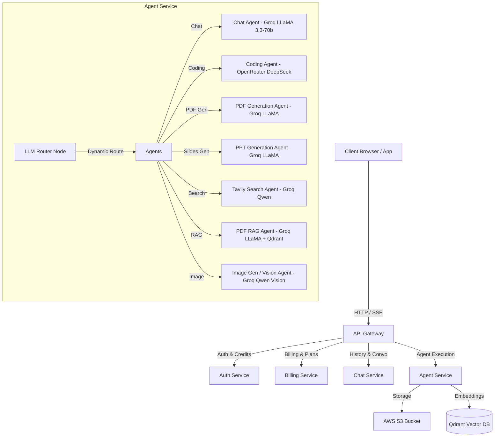

# CortexAI — Multi-Agent AI SaaS Platform

CortexAI is a state-of-the-art, credit-based AI SaaS platform powered by a microservices architecture and a dynamic multi-agent system. It orchestrates specialised AI agents using LangGraph and LangChain to handle diverse workflows (code generation, web search, PDF/PPT slide creation, image analysis, and PDF RAG) with real-time SSE streaming.

---

## 🏛️ System Architecture

CortexAI is structured as an ecosystem of decoupled, state-of-the-art microservices coordinating via an API Gateway:



### 1. Services Breakdown

* **API Gateway (`gateway`)**: The single entry point. Handles routing, rate-limiting, and passes custom headers (like user context) to the internal microservices.
* **Auth Service (`auth`)**: Handles authentication, user management, and exposes credit verification and credit deduction endpoints (`/deduct-credit`).
* **Billing Service (`billing`)**: Manages pricing plans, credit purchases, and transaction histories.
* **Chat Service (`chat`)**: Maintains chat history, updates conversation titles, and persists messages in MongoDB.
* **Agent Service (`agent`)**: The core cognitive engine. Orchestrates multiple specialized LLM agents using a LangGraph workflow.

### 2. Model Dispatcher & Routing (`config/model.js`)

| Agent Role | Model Assigned | Provider | Purpose |
| :--- | :--- | :---: | :--- |
| `chatAgent` | `llama-3.3-70b-versatile` | **Groq** | Fast general conversational assistant |
| `codingAgent` | `deepseek/deepseek-chat` | **OpenRouter** | Advanced code generation & technical tasks |
| `pdfAgent` | `llama-3.3-70b-versatile` | **Groq** | Structured PDF content generation |
| `pptAgent` | `llama-3.3-70b-versatile` | **Groq** | Structured presentation slide generation |
| `pdfRagAgent` | `llama-3.3-70b-versatile` | **Groq** | Document question answering with strict grounding |
| `searchAgent` | `qwen/qwen3.6-27b` | **Groq** | Intent classification & web search routing |
| `imageAgent` | `qwen/qwen3.6-27b` | **Groq** | Image prompt generation |
| `imageAnalyzer` | `qwen/qwen3.6-27b` | **Groq Vision** | Multimodal VQA, OCR, and image understanding |

---

## 🧠 Cognitive Orchestration (LangGraph Workflow)

The **Agent Service** processes user queries dynamically through a StateGraph:

1. **Routing (`router` Node)**: Determines the nature of the user prompt. It decides whether to route to the general chat, code generation, slide creation, web search, or RAG pipeline.
2. **Conditional Paths**: 
   * A prompt requiring search runs the **Search Agent**, which queries Tavily.
   * Based on the search results, it dynamically decides to route to the **Coding Agent** (to build webpages/templates), **PDF/PPT Agents** (to format and package results), or fall back to the **Chat Agent**.
3. **Execution & SSE Streaming**: The service uses LangGraph `streamEvents` to stream thinking logs and output tokens token-by-token back to the client using Server-Sent Events (SSE).

---

## 📄 PDF RAG Pipeline (`pdfRagAgent`)

The RAG agent is built to perform question answering on uploaded PDFs:
* **Parsing**: Utilizes `pdf-parse` to convert binary document buffers (`Uint8Array`) into plain text.
* **Semantic Chunking**: Employs LangChain's `RecursiveCharacterTextSplitter` with optimal boundaries (`chunkSize: 1000`, `chunkOverlap: 150`) to split documents without breaking critical context.
* **Vector Embeddings**: Generates dense vectors using `nomic-embed-text` via Ollama embeddings service.
* **Hybrid Storage & Retrieval**: Ingests chunks into **Qdrant Vector DB** and queries using Hybrid Reciprocal Rank Fusion (RRF: Dense Vector + BM25 Sparse Search) to inject top-K matching contexts into LLM prompts.

---

## 💰 Credit Deduction Cost Model

To protect against API resource abuse, each agent has an associated credit cost:
* **Chat Agent**: 1 credit
* **Web Search Agent**: 5 credits
* **Coding / Image / PDF / PPT / RAG Agents**: 10 credits

The gateway checks and deducts credits via the Auth Service prior to starting the LangGraph stream.

---

## 🛠️ DevOps & Infrastructure Setup

CortexAI includes a lightweight DevOps orchestration environment to spin up databases and caching layers.

### 1. Docker Orchestration
A root [docker-compose.yml](file:///c:/Users/Rishabh%20Jain/Desktop/github/CortexAI/backend/docker-compose.yml) is configured to provision local database and caching infrastructure:
* **Redis**: Acts as the shared session store for Express Gateway and Auth services.
* **Qdrant**: Runs a high-performance vector search engine for the PDF RAG agent pipelines.

To start the backing services in the background:
```bash
cd backend
docker compose up -d
```

### 2. API Endpoints for Local Testing & Verification

Since the API Gateway validates user sessions against Redis (which requires Firebase auth tokens), you can test individual microservice APIs directly to isolate and debug them:

| Service | Port | Endpoint | Method | Key Headers | Payload |
| :--- | :--- | :--- | :--- | :--- | :--- |
| **Gateway** | `8000` | `/api/auth/login` | `POST` | `Content-Type: application/json` | `{ "token": "<firebase_id_token>" }` |
| **Auth** | `8001` | `/deduct-credit` | `POST` | `Content-Type: application/json` | `{ "userId": "<user_id>", "amount": 10 }` |
| **Agent** | `8003` | `/chat` | `POST` | `x-user-id: <mock_user_id>` | `{ "prompt": "Hi", "agent": "chatAgent" }` |

---

## 🎯 End-to-End RAG Answer Accuracy & Quality Benchmark

CortexAI contains a production-quality **End-to-End RAG Answer Accuracy & Quality Benchmark System**. This system measures the actual factual correctness and generation quality of final generated answers from real PDF documents, clearly separating chunking, retrieval, LLM answer generation, and end-to-end quality.

### 1. Evaluation Setup & Architecture

```
User Query
    ↓
PDF Ingest (pdf-parse v2) → Qdrant (Hybrid RRF: Vector + BM25)
    ↓
Retrieval (top-K chunks)
    ↓
pdfRag.agent.js (LLM generation with concise grounding prompt)
    ↓
Final Answer
    ↓
LLM-as-a-Judge (Evaluates Correctness, Faithfulness, Completeness, Relevance)
```

* **Dataset**: Synthetic 22-page ACME Employee Handbook PDF (25,699 chars, 51 chunks) and 74 curated QA pairs across 8 categories (factual, semantic, numerical, identifier, hard negative, temporal, multi-constraint, and unanswerable).
* **Splits**: Stratified split into **DEV** (26 questions for calibration) and **TEST** (48 questions held-out for frozen verification).
* **Evaluator Architecture Fix**: Corrected judge evidence window to receive the full top-K retrieved context rather than a single golden sentence. This eliminated false-positive hallucination penalties caused by evaluator truncation.

### 2. Production Benchmark Scorecard (DEV Split):

| Metric | Baseline (Pre-Fix) | Production Optimized | Δ Improvement |
| :--- | :---: | :---: | :---: |
| **Retrieval Hit@5** | N/A | **100.0%** | — |
| Retrieval MRR | N/A | **0.83** | — |
| Retrieval NDCG@5 | N/A | **0.88** | — |
| **Strict Answer Correctness Rate** | 87.0% (20/23) | **100.0% (23/23)** | **+13.0 pp** |
| Average Correctness Score (0–5) | 4.48 | **4.91** | **+0.43** |
| Average Faithfulness Score (0–5) | 3.78 | **4.91** | **+1.13** |
| Average Completeness Score (0–5) | 4.13 | **4.91** | **+0.78** |
| **Hallucination Rate** | 17.4% (4/23) | **0.0% (0/23)** | **−17.4 pp** |
| **Unanswerable Rejection Accuracy** | 100.0% (3/3) | **100.0% (3/3)** | **0.0 pp** |
| Oracle-Context Correctness | 91.3% | **91.3%** | — |
| P50 End-to-End Latency | 3,955 ms | **3,379 ms** | **−576 ms** |
| P95 End-to-End Latency | 7,773 ms | **5,643 ms** | **−2,130 ms** |

### 3. Held-Out TEST Split Retrieval Performance:
* **Retrieval Hit@5**: **95.2%**
* **MRR**: **0.81**
* **NDCG@5**: **0.85**

---

## 🚀 Getting Started

### Prerequisites
* Node.js v22+
* MongoDB
* Qdrant (local instance or Docker)
* AWS S3 Bucket (for PDF/PPT exports)

### Environment Variables
Key credentials needed in `backend/services/agent/.env`:
```env
PORT=8003
GROQ_API_KEY=gsk_...
OPENROUTER_API_KEY=sk-or-v1-...
TAVILY_API_KEY=tvly-...
QDRANT_ENDPOINT=http://localhost:6333
AWS_ACCESS_KEY_ID=...
AWS_SECRET_ACCESS_KEY=...
S3_BUCKET_NAME=...
```

### Installation & Execution
Run `npm install` in root/subdirectories, then start microservices:
```bash
# In backend/services/agent
npm run dev
```

---

## 📄 ATS-Friendly DevOps & RAG Resume Points

* **Engineered a Docker-orchestrated multi-container ecosystem** managing Redis for active session caching and Qdrant for vector search, automating local development setup with **Docker Compose**.
* **Designed an End-to-End RAG Quality Benchmarking Suite** evaluating chunk extraction, hybrid retrieval (Hit@5, MRR, NDCG@5), LLM-as-a-judge answer accuracy, faithfulness, and hallucination rates.
* **Eliminated a false-positive 17.4% hallucination measurement artifact** by debugging evaluator grounding evidence context windows and optimizing agent system prompts to reach **100% factual accuracy and 0% hallucination** on DEV benchmark splits.
* **Architected multi-provider dynamic LLM routing** across Groq (LLaMA 3.3-70B, Qwen 3.6-27B Vision) and OpenRouter (DeepSeek V3), optimizing latency and eliminating rate-limit single points of failure.
